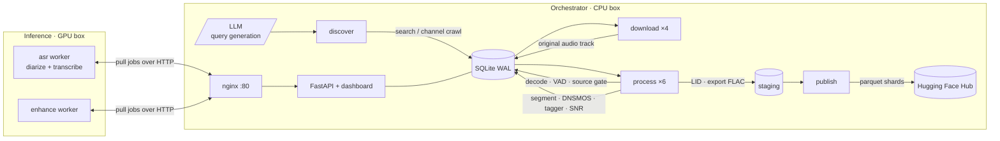
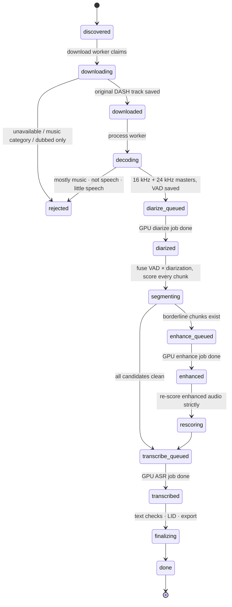
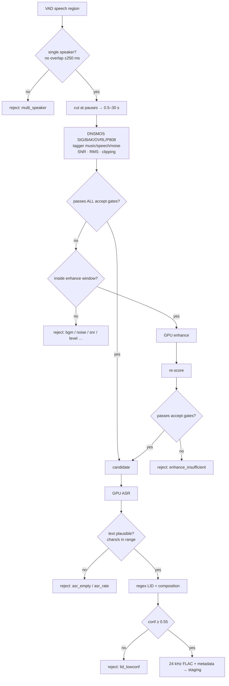
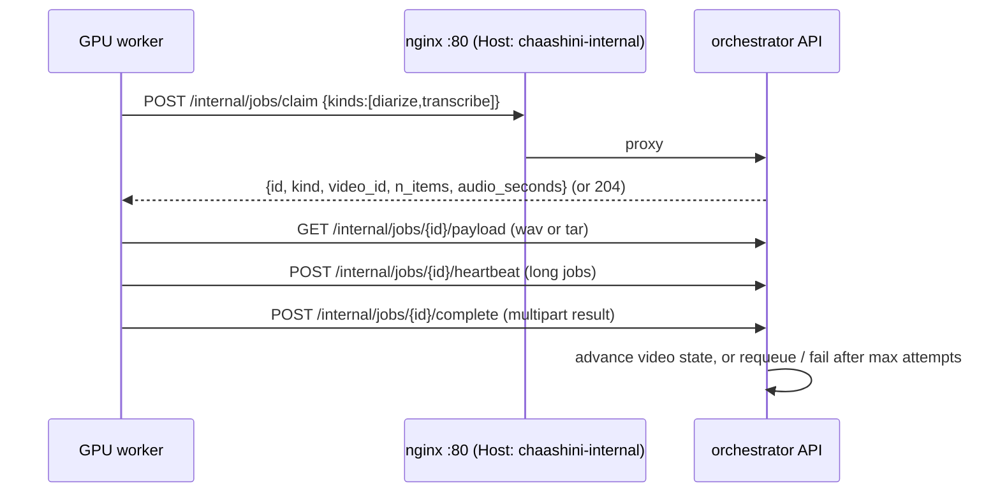

# Chaashini — architecture

Chaashini (चाशनी, "sugar syrup") turns publicly available long-form spoken-word audio into a
strictly quality-gated, single-speaker, transcribed, language-tagged speech corpus, and keeps
pushing it to the Hugging Face Hub as it grows.

Two machines, one state store:

* **Orchestrator (CPU box, 128 cores)** — discovery, download, decode, VAD, scoring, segmentation,
  language ID, export, sharding, publishing, dashboard. State lives in one SQLite (WAL) database.
* **Inference box (shared L4 GPU)** — three neural models behind two *pull* workers that fetch jobs
  from the orchestrator over HTTP (the GPU box accepts no inbound connections except 22/80).

## Per-source state machine

Every source recording walks a linear state machine. Working states are leased; if the worker
dies the janitor returns the row to the previous state after the lease expires, so nothing is
ever lost or processed twice.

## Chunk decision logic

## Quality gates (defaults, `configs/chaashini.yaml`)

| gate | accept | enhance window |
|---|---|---|
| DNSMOS OVRL | ≥ 3.0 | ≥ 2.3 |
| DNSMOS SIG | ≥ 3.2 | ≥ 3.3 (speech must be healthy; only background problems are worth enhancing) |
| DNSMOS BAK | ≥ 3.8 | — |
| P.808 MOS | ≥ 3.0 | — |
| music probability (tagger, max over 4 s windows) | ≤ 0.15 | ≤ 0.30 |
| speech probability | ≥ 0.5 | — |
| SNR (VAD-informed) | ≥ 20 dB | ≥ 8 dB |
| RMS level | −34 … −6 dBFS | — |
| clipping ratio | ≤ 0.1 % | — |
| effective bandwidth | ≥ 4.5 kHz (rejects narrowband/telephone audio) | — |
| VAD speech ratio | ≥ 0.6 | — |
| speaker dominance | ≥ 0.9 | — |

Source-level gate: a recording is dropped whole if ≥ 50 % of 24 sampled windows are music, if the
speech tag averages < 0.3, or if VAD finds < 15 % speech. Enhancement is capped at 40 % of a
recording's chunks (max 400) so the GPU is never monopolised by bad sources.

## GPU job protocol

Payloads: `diarize` = 16 kHz WAV master; `transcribe` = tar of 16 kHz chunk WAVs + manifest;
`enhance` = tar of 44.1 kHz chunk WAVs + manifest (with enhancer parameters).
Results: `diarize` = npz (per-80 ms speaker probabilities + segments); `transcribe` = JSON
{id: text}; `enhance` = tar of enhanced WAVs.

## Language identification

Unicode-script regexes classify every token (Devanagari, Bengali–Assamese, Gurmukhi, Gujarati,
Odia, Tamil, Telugu, Kannada, Malayalam, Perso-Arabic, Ol Chiki, Meetei Mayek, Latin). Script
shares give the *composition*; scripts shared by several languages are disambiguated with
function-word lists plus script-specific characters (e.g. Assamese ৰ/ৱ, Marathi ळ) and a small
prior for the language the source was discovered under. Output: dominant language, confidence
(how sure the label is), dominance (share of the dominant language), composition, `code_mixed` flag.

**Source-level consensus.** A recording is (almost always) monolingual apart from English
code-mixing, so after every chunk is identified the duration-weighted majority script and
language of the recording are computed. Chunks whose transcript is in another script
(`script_outlier`), that contain stray letters from other scripts, or that have words mixing two scripts
inside a single token (both `script_mix`) are rejected:
these are the cases where the ASR was unreliable, and a regex LID on such text would otherwise
tag them confidently but wrongly. Same-script sibling labels (Bengali/Assamese, Hindi/Marathi,
...) snap to the recording's majority. The detected language also overrides the discovery hint
for channel expansion.

## Publishing

Accepted chunks are staged as FLAC + JSON sidecars. Once ≥ `push_every_hours` (10 h) of new audio
is staged, the publish worker packs per-language parquet shards (HF `datasets` Audio feature,
~400 MB each), uploads them in one commit together with a refreshed dataset card, verifies the
files are listed in the repo, and only then deletes local copies. Failures leave shards in
`built` state and are retried every 5 minutes.

## Robustness checklist

* leases + janitor for every working state; attempt budgets; per-stage error capture
* global source cool-down with exponential back-off on rate limits / bot checks
* disk-free guard pauses downloads; in-flight cap bounds work-dir usage; TTL sweeper
* GPU jobs requeued on failure up to `gpu.max_attempts`; an enhancement failure degrades gracefully (chunks rejected, video continues)
* supervisor restarts crashed workers with back-off; shell watchdogs restart the supervisor and GPU workers
* every publish verified against the Hub listing before local deletion
